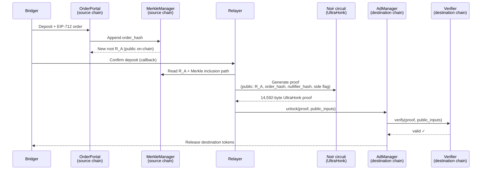

ProofBridge uses zk-SNARKs (specifically [UltraHonk](https://aztec.network/) on BN254) as the cryptographic bridge between two chains that cannot read each other's state. The proof is a **succinct, on-chain-verifiable attestation** — the destination chain confirms what happened on the source chain by checking a fixed-size proof, with no oracle, validator committee, or relayer signature in the trust path.

## What problem ZK proofs solve here

Two practical constraints push ProofBridge toward SNARKs:

1. **Each chain can only see itself.** A Soroban contract cannot read Sepolia's Merkle Mountain Range, and an EVM contract cannot read Stellar's. There is no native cross-chain read primitive on either platform. The destination chain has to be *told* what happened on the source chain — by something the chain can verify cryptographically rather than something it has to trust.
2. **Naive verification is too expensive on-chain.** A direct MMR inclusion proof for a deep tree means dozens of Poseidon2 hashes per verification call. Doing that on-chain on every settlement would burn through Soroban resource budgets and EVM gas. A SNARK compresses the entire MMR-inclusion + order-hash + nullifier check into one fixed-size 14,592-byte proof verified in two pairings plus an MSM.

The SNARK compresses MMR-inclusion + order-hash + nullifier into one fixed-size object that both Verifier contracts can check directly.

## What the proof actually attests

Each settlement consumes a single proof. The proof's public inputs are visible on-chain on both chains:

| Public input | What it asserts | Visibility |
|---|---|---|
| `order_hash` | The exact order being settled (EIP-712 digest of the trade) | Already on-chain — committed to the MMR at deposit time |
| `target_root` | The MMR root the proof is checked against | Already on-chain — read from `MerkleManager` of the opposite chain |
| `nullifier_hash` | The one-time-use marker for this settlement | Public output of the proof, recorded on settlement |
| `ad_contract` | Which side of the trade this proof unlocks (`true` = AdManager / destination, `false` = OrderPortal / source) | Public flag, prevents cross-side replay |

Given those public inputs, the circuit proves three statements simultaneously:

<AccordionGroup>
  <Accordion title="MMR inclusion">
    The `order_hash` is included under `target_root` at some position in the Merkle Mountain Range. The circuit recomputes the Poseidon2 hash chain from leaf to root using the prover-supplied sibling and peak hashes. If the recomputed root doesn't match `target_root`, the constraint fails.

    This is the cross-chain attestation: chain A's MMR root is a public on-chain value; the proof says "an order_hash matching the trade is in this tree."
  </Accordion>
  <Accordion title="Nullifier derivation">
    The `nullifier_hash` is `poseidon2(secret_half, order_hash)` — whoever produced the proof knew a per-trade `secret` whose halves bind to this specific order. The on-chain contracts record `nullifier_hash` after a successful settlement and reject any future proof carrying the same value, which prevents the same deposit from being claimed twice.

    The `secret` is a uniqueness device — its job is to make each settlement attempt singular and non-replayable.
  </Accordion>
  <Accordion title="Side binding">
    The `ad_contract` flag selects which half of the secret is hashed with the order — left half for the destination side, right half for the source side. This means the same proof cannot be replayed in the opposite direction; the AdManager and OrderPortal each accept exactly one of the two valid forms.
  </Accordion>
</AccordionGroup>

Everything else about the trade — amounts, tokens, sender, recipient — is encoded in `order_hash` and is committed to the MMR via the public EIP-712 struct.

## How the cross-chain flow uses the proof

The destination chain (`AdManager` + `Verifier`) never reads the source chain directly. It receives:

- The source chain's MMR root `R_A` (a public on-chain value, brought across by the relayer).
- A SNARK proof binding `R_A`, `order_hash`, and `nullifier_hash` together.

If the proof verifies, the destination chain has cryptographic evidence that the deposit committed to `R_A` happened. The relayer cannot fabricate a valid proof for a deposit that doesn't exist — because they would have to forge a Merkle inclusion path for a leaf that isn't in the tree, which the SNARK constraints catch.

The same proof is then submitted to the source chain's `OrderPortal` (with the `ad_contract` flag flipped) to release the Maker's payout. Two independent verifications of the same statement, one per chain.

## Why UltraHonk specifically

UltraHonk on BN254 was chosen for three reasons:

- **Compact, constant-size proofs.** 456 BN254 scalars (14,592 bytes), independent of circuit size. Fits in a single Soroban transaction.
- **Cheap on-chain verification.** Two pairings + one G1 multi-scalar multiplication via Soroban's native [BN254 host functions](/reference/soroban-verifier) — and `ecPairing` / `ecMul` / `ecAdd` precompiles on Ethereum.
- **Same proof bytes verified by both chains.** The `bb` prover produces one proof; both verifiers consume the same bytes against the same SRS. See [Soroban verifier internals](/reference/soroban-verifier) for the full Soroban path and [Smart contracts](/reference/smart-contracts) for the EVM Verifier.

## End-to-end safety from the proof

Because the proof has to verify on-chain on both sides:

- The relayer cannot fabricate a deposit (no Merkle inclusion).
- A Maker cannot claim settlement without a matching deposit (order_hash mismatch).
- Neither party can replay an old proof (nullifier already recorded).
- The proof for one side cannot be reused on the other side (`ad_contract` flag binds the nullifier derivation).

These guarantees come from the on-chain Verifier rejecting the proof if any constraint fails — not from any off-chain authority.

<Warning>
  BLS signature aggregation — which will let both counterparties co-sign a proof of agreement so the relayer is no longer the trusted authorizer of trade matching — is on the [roadmap](/reference/roadmap). Funds are protected today by the on-chain proof verification described above; the BLS milestone removes the relayer's role in *initiating* settlement, not in verifying it.
</Warning>

## Related references

- [Merkle Mountain Range](/concepts/merkle-mountain-range) — how `target_root` is built and why both chains can reproduce the same Poseidon2 hashing.
- [Order hashing](/concepts/order-hashing) — exact construction of the EIP-712 digest that becomes `order_hash`.
- [Soroban verifier internals](/reference/soroban-verifier) — the Stellar-side proof-checking pipeline and BN254 host calls.
- [Smart contracts](/reference/smart-contracts) — Verifier role, addresses, and EVM-side details.
