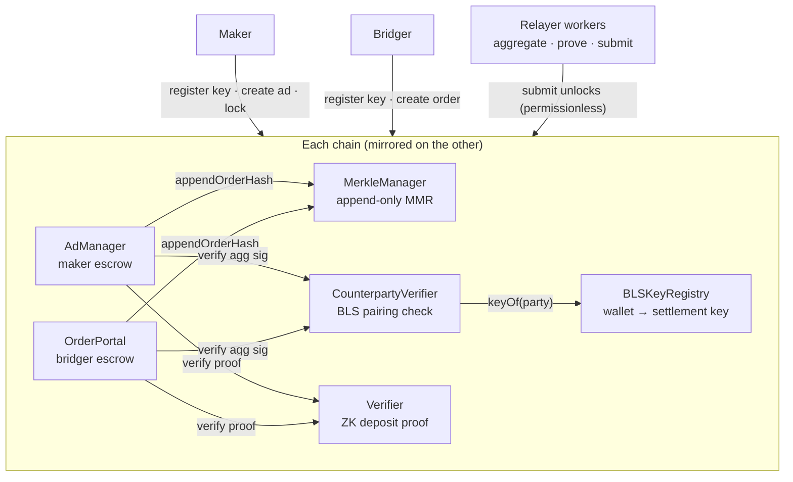

## Per chain: four contracts

| Contract | Role |
| --- | --- |
| `AdManager` | maker escrow — ads, liquidity, lock-for-order |
| `OrderPortal` | bridger escrow — orders and deposits |
| `MerkleManager` | the append-only MMR of deposits |
| `BLSKeyRegistry` | wallet → settlement-key registry, proof-of-possession enforced |

Deposits into either escrow append to the MMR. Unlocks verify the
aggregated BLS signature against the registry and the deposit proof
against the counterparty chain's root.

## The relayer: coordinator, not authority

The relayer holds **no funds** and grants **no approvals**. Its jobs:

- mirror each chain's MMR and serve trade/route/ad state over the API
- collect the two parties' co-signatures and reject malformed ones early
- run the background pipeline: **aggregate → prove → submit**
- sponsor gas for key registrations and unlocks

Every fund movement is gated by the parties' signatures plus proofs, so
any honest actor could run the same code and submit the same
transactions — unlocks are permissionless by design.

## Background workers

Settlement work is queued, idempotent, and crash-safe:

- **Aggregator** — combines the two BLS signatures once both arrive
- **Prover** — generates the two deposit proofs (seconds each)
- **Submitter** — broadcasts the unlocks with retry, stuck-transaction
  handling, and a circuit breaker; confirms against chain state

A watchtower reconciles the database against the chains and raises alarms;
the database is a rebuildable projection of chain events, not a source of
authority.

## What changed from v1

The v1 relayer pre-authorized every trade with its own signature inside
each contract call. Those parameters — the authorization token, signature,
and expiry — are deleted from every state-changing entry point on both
chains. The v1 docs remain available in the version picker for the
historical design.
