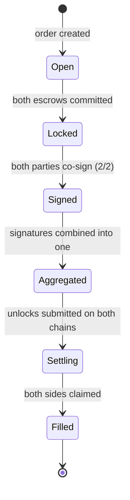

Settlement is authorized by two BLS signatures — one from each party —
over one fixed message: the **SettlementAuth**.

## What gets signed

Six fields, byte-identical for both parties:

| Field | Meaning |
| --- | --- |
| `domainTag` | protocol constant — separates settlement signatures from everything else |
| `orderChainId` / `adChainId` | the two chains of this trade |
| `orderHash` | the hash binding every order parameter (amounts, parties, recipients, salt) |
| `orderChainRoot` / `adChainRoot` | both chains' Merkle roots at signing time |

Because the message commits to the order hash *and* both roots, a
signature authorizes exactly one settlement of exactly one trade against
exactly the deposits that existed — it can't be replayed against different
state, and the backend rejects a pair signed over different roots.

## Who signs

The trade's two **party wallets**: the ad creator (maker) and the bridger.
Each must sign with the key registered for that wallet — the contracts
check `keyOf(party)` at unlock, so a key registered under a different
wallet is invisible for this trade.

Signing is silent: the settlement key signs locally, with no on-chain
transaction. Parties sign independently, in any order.

## The status ladder

| State | Meaning |
| --- | --- |
| `Open` | order created, deposits pending |
| `Locked` | both escrows committed — co-signing can begin once deposits confirm |
| `Signed (2/2)` | both signatures collected |
| `Aggregated` | the two signatures combined into one; proof generation queued |
| `Settling` | unlocks submitted on-chain |
| `Filled` | both sides claimed — trade complete |

Everything after `Signed (2/2)` is background workers — no user action.
The relayer aggregates, proves, and submits; it can't forge either
signature and can't settle without both.
