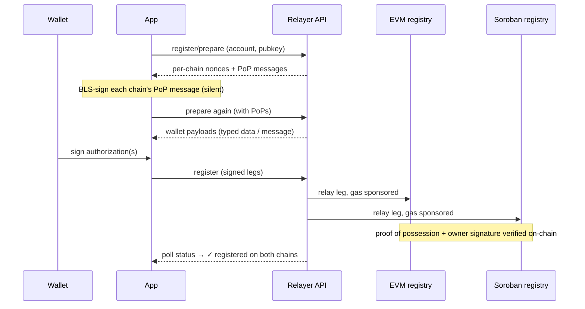

Every trading wallet holds a **BLS12-381 settlement key**. At unlock, the
contracts look up the registered keys for the trade's two party wallets and
verify the combined signature against them — the keys are how the chain
knows *both traders* approved the settlement.

## Derived, not stored

The key is deterministically derived from a wallet signature over a fixed
message:

```
ProofBridge BLS key derivation v1 — do not sign on other dapps | key #0000
```

Sign the same message with the same wallet and you get the same key — on
any device. There is no seed phrase to back up and the server never sees
the key material. The signature is stretched into a valid BLS secret key
(HKDF, per the IETF BLS KeyGen), and the app stores an encrypted copy
locally so routine co-signs need only one wallet tap.

### Optional second seed

The wallet signature can be strengthened with a **second seed**, so
deriving the key takes something you *have* (the wallet) plus something
you *know or are*:

- **None** (the default today) — the wallet signature alone derives the key
- **Password** — stretched with Argon2id, so a human passphrase can't be
  brute-forced even by someone holding the wallet signature
- **Passkey** — via the WebAuthn PRF extension: a deterministic secret
  gated by your device's biometrics (fingerprint / Face ID) and synced by
  the platform (Google Password Manager, iCloud Keychain)

The chosen mode is stored as a non-secret hint on your key record, so a
fresh device knows which flow to run — the seed itself never leaves your
device.

<Frame caption="The derivation signature in the wallet — note the message text and the key index">
  
</Frame>

The `key #NNNN` counter is the **rotation index**: revoking a key advances
it, so the replacement key is genuinely different (the message changes, so
the wallet signature changes, so the key changes).

## Registration flow



For **Stellar wallets**, the Soroban leg is submitted by the wallet itself
(a normal Soroban transaction under `require_auth`) instead of being
relayed; the EVM leg is still relayed and gas-sponsored.

## Registered on both chains

Registration writes the key's commitment to the `BLSKeyRegistry` on
**both** chains, because a trade settles on both. The registration:

- carries a **proof of possession** — a BLS signature proving you hold the
  private key you're registering (prevents rogue-key registrations)
- is authorized by the **wallet's own signature** (EIP-712 or SEP-53
  depending on the wallet/chain pairing)
- is relayed and gas-sponsored by the relayer — the user just signs. Anyone
  can self-relay the same registration on-chain instead.

## Per wallet, not per user

The contracts check `keyOf(adCreator)` and `keyOf(bridger)` — the two
deposit wallets of the trade. They have no notion of a "user" with linked
wallets. If you make markets from a Stellar wallet and bridge from an EVM
wallet, each registers its own key (a one-time step per wallet).

## Rotation and revocation

- **Rotate** by registering a new key over the old one — in-flight trades
  block a rotation until they settle.
- **Revoke** kills the key on both chains. Revocation is refused while you
  have open trades (the contracts enforce this), and a revoked wallet can
  register again — the next key derives at the next rotation index.
