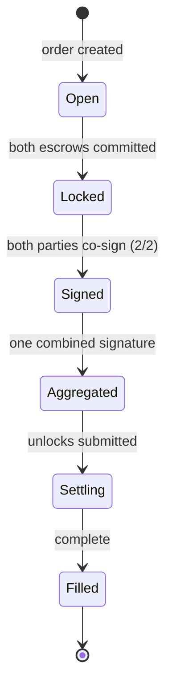

The **Orders** page shows every trade you're a party to, split into
**Pending** and **Completed** tabs.

<Frame caption="Pending — a trade waiting on the maker's lock">
  
</Frame>

## The status ladder

## What the card asks of you

| You see | It means |
| --- | --- |
| **Complete Order** | your createOrder was never submitted — click to retry with the same data (no new reservation) |
| **Waiting for Creator** | your deposit is in; the maker hasn't locked yet |
| **Lock Tokens** (maker) | a bridger funded an order on your ad — lock the matching liquidity |
| **Confirming (n/2)** | deposits waiting for chain confirmations |
| **Register Key · 0xAB…12** | the named wallet has no settlement key — registration opens pre-targeted |
| **Co-sign (n/2)** | deposits are settlement-grade — one click to sign |
| **Signed — waiting for counterparty** | your half is in |
| **Aggregating… / Settling…** | background workers at work — nothing to do |
| **Completed / Claimed** | funds delivered |

<Frame caption="Completed — every settled trade, both directions">
  
</Frame>

## Expired orders

An order whose deposit never lands is cancelled after ~30 minutes and
drops off the pending tab — the maker's reserved liquidity is released.
Create a fresh order to try again.

## Notifications

The bell tracks lifecycle events — order landed on your ad, trade locked,
order expired — so makers without a bot know when to act.
