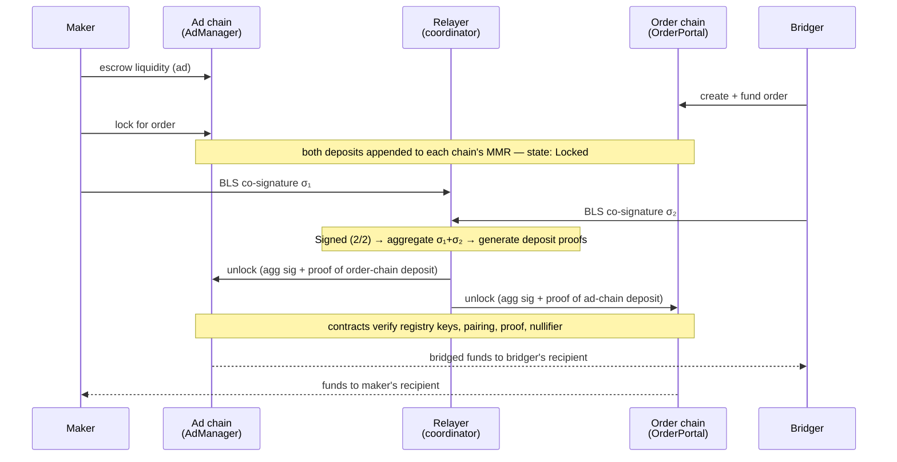

A trade moves through six states:

```
Open → Locked → Signed (2/2) → Aggregated → Settling → Filled
```



## 1. The maker posts an ad

A maker escrows liquidity in the **AdManager** on their chain and publishes
a route (say, USDC on Sepolia → USDC on Stellar) with limits and a price.

## 2. The bridger opens an order

The bridger picks an ad, creates an order, and funds it — their tokens go
into the **OrderPortal** escrow on the order chain. Creating an order
reserves the matching slice of the maker's ad; unfunded reservations expire
automatically, so abandoned checkouts never strand maker liquidity.

## 3. The maker locks

The maker (or their bot) locks the matching funds from the ad. Both escrows
are now committed to this specific trade: state **Locked**.

Each deposit is appended to that chain's **Merkle Mountain Range** — an
append-only tree the deposit proofs are built against.

## 4. Both parties co-sign

Once both deposits are confirmed, each party signs a fixed settlement
message — the **SettlementAuth** — with their registered BLS key. The
message binds the exact order and both chains' Merkle roots, so a signature
can't be replayed against different state.

Signing is silent (no wallet transaction — the settlement key signs
locally) and the two parties sign independently. Counter shows
**Signed (2/2)** when both are in.

## 5. Background workers finish the trade

From here everything is automatic:

1. **Aggregate** — the two BLS signatures combine into one.
2. **Prove** — a zero-knowledge proof is generated per side showing the
   counterparty's deposit is included in the other chain's Merkle root.
   Proof generation takes seconds.
3. **Submit** — the relayer submits the unlock on each chain, paying gas.

State advances **Aggregated → Settling → Filled**.

## 6. On-chain verification

Each chain's `unlock` verifies three things before releasing funds:

- the **aggregated BLS signature** against the keys registered for the two
  party wallets in the on-chain `BLSKeyRegistry`
- the **zero-knowledge deposit proof** against the counterparty chain's
  Merkle root
- the **nullifier** — each deposit can be unlocked exactly once

Unlocks are permissionless: the transaction data is public and funds always
reach the hash-bound recipient regardless of who submits.

<Note>
There is no ProofBridge approval anywhere in this flow. The pre-auth
authorization token and signature parameters from v1 no longer exist in
the contracts.
</Note>
